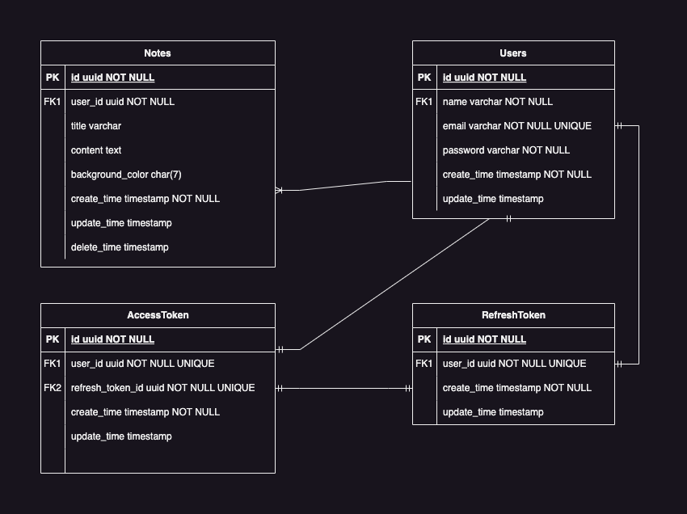

<a id="readme-top"></a>

[![MIT License][license-shield]][license-url]
[![LinkedIn][linkedin-shield]][linkedin-url]


<!-- PROJECT LOGO -->
<br />
<div align="center">
  <h3 align="center">Notes API</h3>
  <p align="center">
    <br />
    <a href="https://api.notes.daniel-enrique.com/doc"><strong>Explore the api docs »</strong></a>
    <br />
    <br />
  </p>
</div>


<!-- TABLE OF CONTENTS -->
<details>
  <summary>Table of Contents</summary>
  <ol>
    <li>
      <a href="#about-the-project">About The Project</a>
      <ul>
        <li><a href="#built-with">Built With</a></li>
      </ul>
    </li>
    <li><a href="#features">Features</a></li>
    <li>
      <a href="#documentation">Documentation</a>
    </li>
    <li><a href="#installation">Installation</a></li>
    <li><a href="#license">License</a></li>
    <li><a href="#contact">Contact</a></li>
    <li><a href="#acknowledgments">Acknowledgments</a></li>
  </ol>
</details>


<!-- ABOUT THE PROJECT -->
## About The Project

This is a RESTful API for a notes application, developed using Go. Although the API is designed to be simple in terms of business logic, it serves as a robust example of a Go project implementation. It is intended to be a solid starting point for more complex applications.

## Features

- [x] Basic Authentication
- [x] Notes Managment
- [ ] File attachments
- [ ] Google Sign-In

## Built With


* Programming language - [Go](https://go.dev)
* Http server - [net/http](https://pkg.go.dev/net/http)
* Database - [CockroachDB](https://www.cockroachlabs.com/docs/stable/)
* Cache - [Redis](https://redis.io/)

<p align="right">(<a href="#readme-top">back to top</a>)</p>


## Documentation

* [Swagger Documentation](https://api.notes.daniel-enrique.com/doc) 


<p align="right">(<a href="#readme-top">back to top</a>)</p>


<!-- INSTALLATION -->
### Installation

1. Install Go 1.22.4 [https://go.dev/doc/install](https://go.dev/doc/install)
2. Clone the repo
   ```sh
   git clone https://github.com/daniarmas/notes.git
   ```
3. Install Go dependencies
   ```sh
   go mod download
   ```
4. Install Docker [https://docs.docker.com/desktop/](https://docs.docker.com/desktop/)
5. Deploy docker compose file
   ```sh
   cd deploy
   docker compose -f docker-compose-dev.yaml up -d
   ```
6. Run the app
   ```sh
   go run main.go run
   ```

<p align="right">(<a href="#readme-top">back to top</a>)</p>

<!-- # Entity Relationship Diagram
 -->


<!-- LICENSE -->
## License

Distributed under the MIT License. See `LICENSE.txt` for more information.

<p align="right">(<a href="#readme-top">back to top</a>)</p>


<!-- CONTACT -->
## Contact

[Linkedin]([Linkedin](https://www.linkedin.com/in/d3v06/))

<p align="right">(<a href="#readme-top">back to top</a>)</p>


<!-- ACKNOWLEDGMENTS -->
## Acknowledgments

* [Sqlc](https://docs.sqlc.dev/en/latest/#)
* [PostgreSQL Driver](https://github.com/jackc/pgx)
* [Library for CLI apps](https://github.com/spf13/cobra)
* [Redis client](https://github.com/redis/go-redis/)

<p align="right">(<a href="#readme-top">back to top</a>)</p>


<!-- MARKDOWN LINKS & IMAGES -->
<!-- https://www.markdownguide.org/basic-syntax/#reference-style-links -->
[license-shield]: https://img.shields.io/github/license/othneildrew/Best-README-Template.svg?style=for-the-badge
[license-url]: https://github.com/daniarmas/notes/blob/main/LICENSE
[linkedin-shield]: https://img.shields.io/badge/LinkedIn-0077B5?style=for-the-badge&logo=linkedin&logoColor=white
[linkedin-url]: https://www.linkedin.com/in/d3v06/

[Go.dev]: https://img.shields.io/badge/Go-00ADD8?style=for-the-badge&logo=go&logoColor=white
[Go-url]: https://go.dev/
[Redis.io]: https://img.shields.io/badge/redis-%23DD0031.svg?&style=for-the-badge&logo=redis&logoColor=white
[Redis-url]: https://redis.io/
[Cockroachlabs.com]: https://img.shields.io/badge/Cockroach%20Labs-6933FF?style=for-the-badge&logo=Cockroach%20Labs&logoColor=white
[Cockroachlabs-url]: https://www.cockroachlabs.com/
